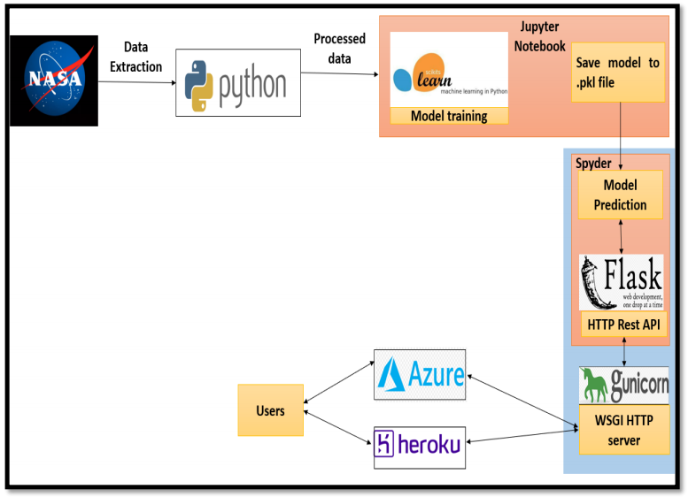
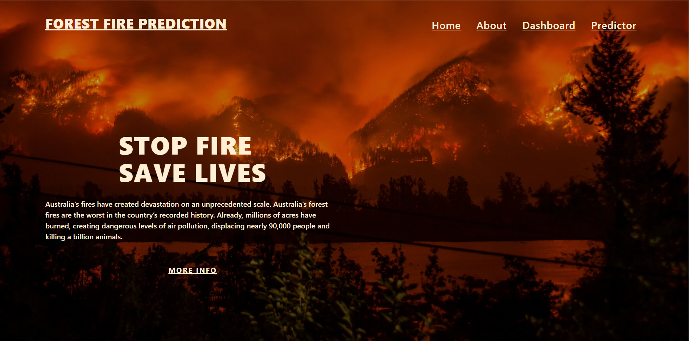
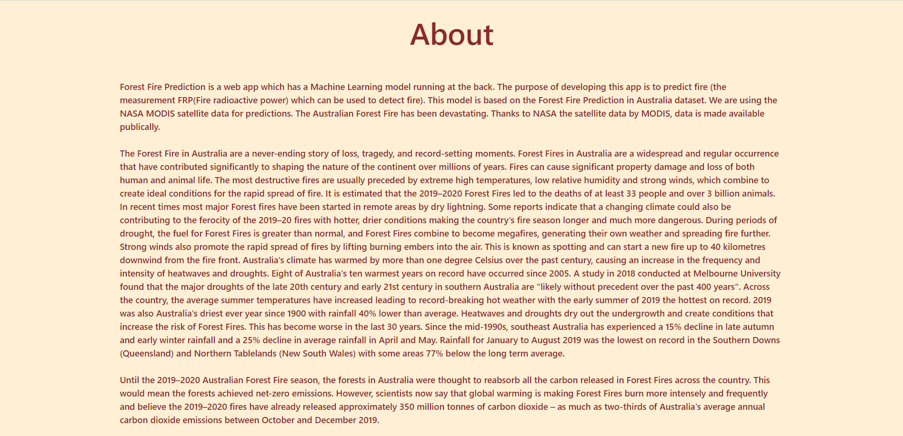
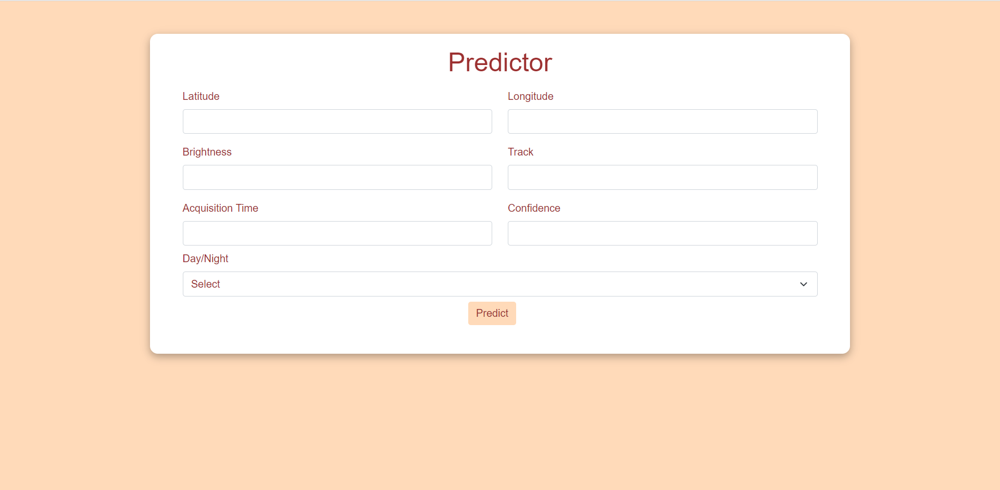

# Forest_Fire_Prediction
Forest Fire Prediction is a web app which has a Machine Learning model running at the back. The purpose of developing this app is to predict fire (the measurement FRP(Fire radioactive power) which can be used to detect fire). This model is based on the Forest Fire Prediction in Australia dataset. We are using the NASA MODIS satellite data for predictions. The Australian Forest Fire has been devastating. Thanks to NASA the satellite data by MODIS, data is made available publically. 
 
# Website Link: ["https://forestfirepredictionapp.herokuapp.com/"](https://forestfirepredictionapp.herokuapp.com/)

# Tech Stack
* Front-End: HTML, CSS, Bootstrap
* Back-End: Flask
* IDE: Jupyter notebook

# Design Model

# Solution Approach
   Initially we started with the data collection that was done by requesting to NASA FIRMS. We are 
considering data from 3 years i.e. 2018, 2019, 2020. Given below is the link to generate download request: 
["https://firms.modaps.eosdis.nasa.gov/download/"](https://firms.modaps.eosdis.nasa.gov/download/) 
   You have to share the Email id to generate the download request, data source (MODIS/VIIRS), start date, 
end date, output format, area of interest. Then you will receive the link to download the data via email. After 
getting the data we have loaded the data of all the 3 years than we have done the concatenation of all the 3 
years. After that the raw data needed to be pre-processed to remove the NAN / Missing values in which we 
also tried doing various imputation but at the end we decided to drop those tuples as new category was 
getting introduced after imputation. After data pre-processing, Exploratory Data Analysis (EDA) was 
performed to get some insights about the data also we decided not to remove the outliers from the dataset 
because considering our problem statement it was normal to have extreme values so outliers needs to be 
identified. Then the feature selection was done based on the correlation. We tried out different algorithm 
and at the end the algorithm that we decided to use for Frp prediction is Random Forest Regressor. After 
selection of the algorithm, we also did the hyperparameter tuning using optuna. An at the end model is 
deployed using Flask at Heroku and Azure.

# How to run this app
* First create a virtual environment by using this command:
* conda create -n myenv python=3.7
* Activate the environment using the below command:
* conda activate myenv
* Then install all the packages by using the following command
* pip install package_name
* Now for the final step. Run the app
* python app.py

# Some screenshots of the app
* Landing Page:

* About Rainy Brain:

* Dashboard:

* Predictor:

# Model Deployment
* The model is deployed using Flask at Heroku server at the [link](https://rainy-brain.herokuapp.com/)

